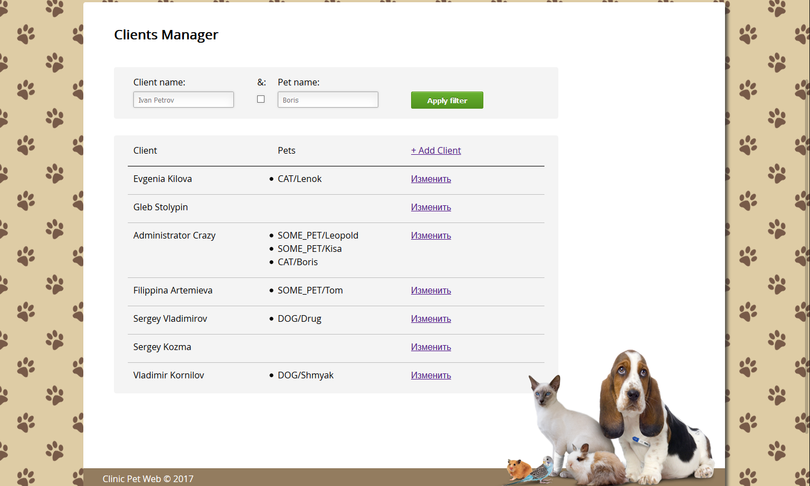
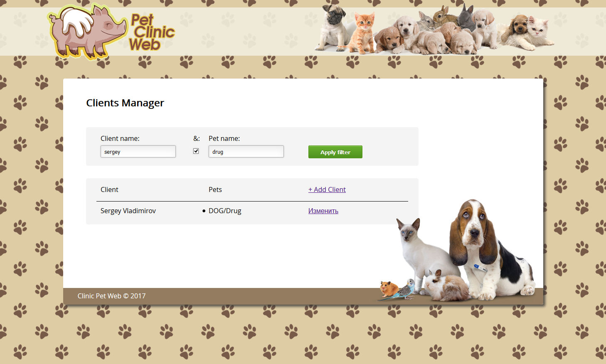
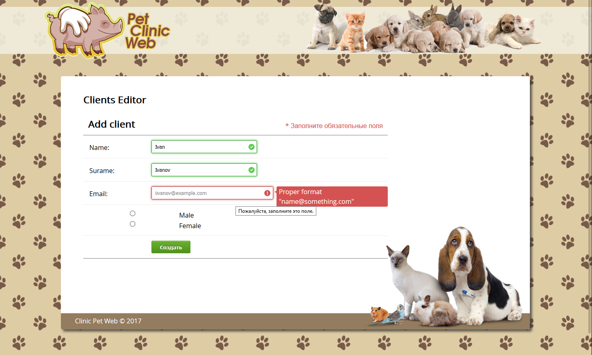
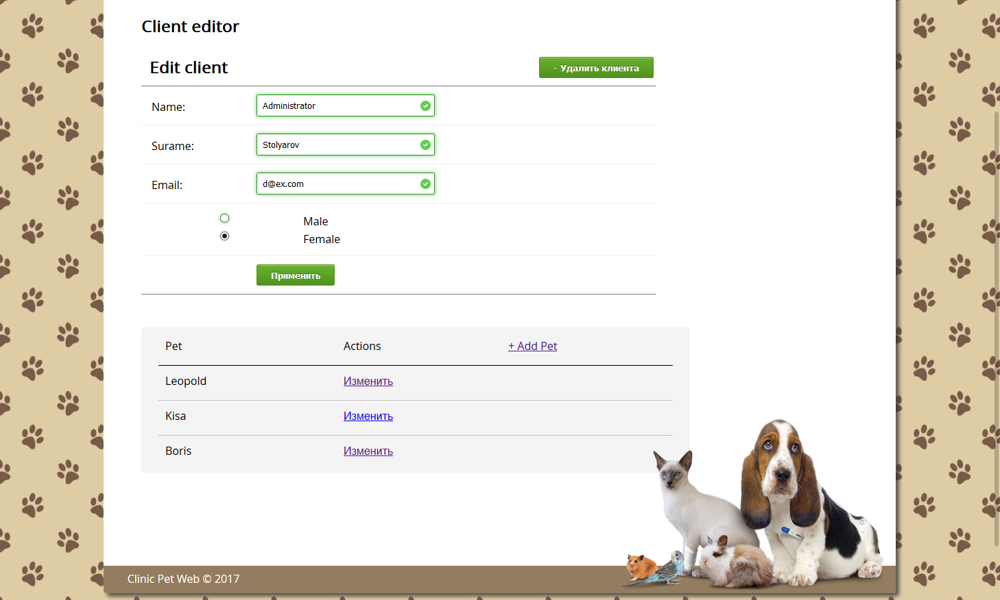
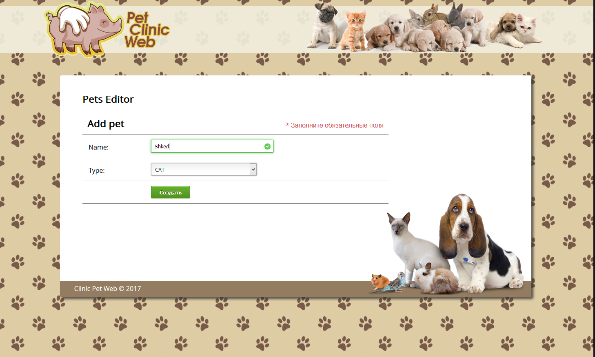

# КЛИНИКА ДОМАШНИХ ЖИВОТНЫХ

Предназначена для хранения клиентов клиники и их питомцев.
 Доступные виды питомцев: кошка, собака, другое животное.

Программа позволяет:

1) Просматривать всех клиентов и их животных

2) Искать клиентов клиники:
 • по части полного (имя фамилия) имени клиента (без учета регистра букв);
 • по части имени какого-либо из питомцев клиента(без учета регистра букв);
 • по обоим вышеперечисленным признакам с логическим условием ИЛИ либо И;

3) Добавлять новых клиентов в клинику.

4) Редактировать клиента клиники.
 • изменение данных клиента;
 • удаление клиента из клиники;
 • добавление нового питомца;
 • изменение данных питомца;
 • удаление питомца;

