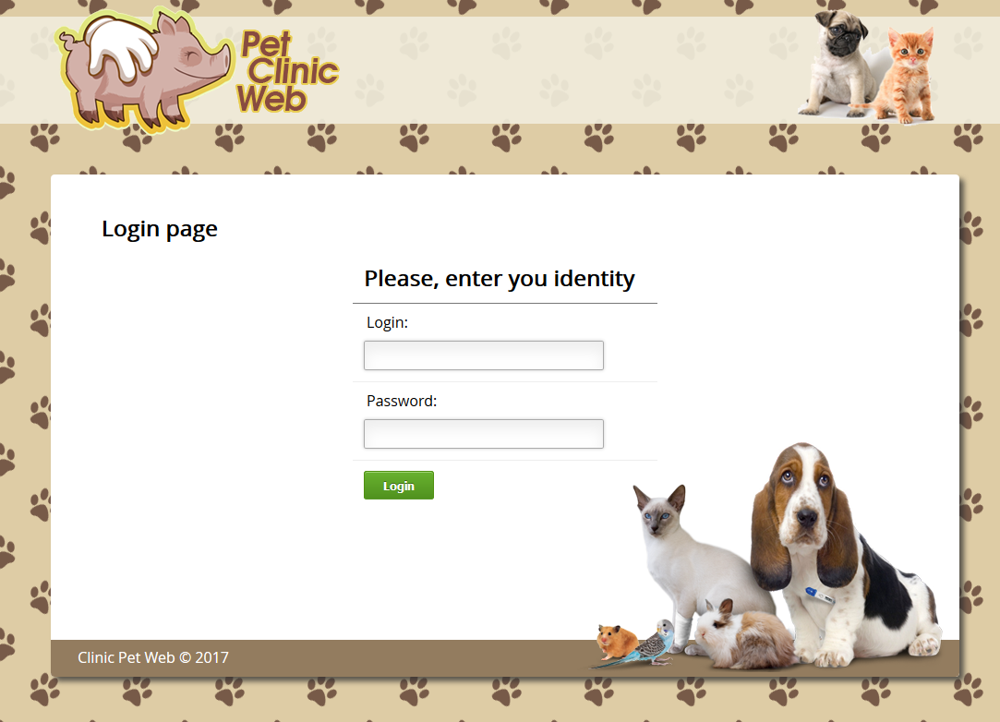

# КЛИНИКА ДОМАШНИХ ЖИВОТНЫХ #2

Является переработанной версией [Клиники домашних животных #1](https://github.com/maks-sl/JavaPetClinic)
 
 
Существующий функционал приложения дополнен авторизацией и контролем доступа, существенно уменьшено количество кода благодаря применению нижеследующих технологий. 

Достижения:

• Spring DI. Доступ ко всем моделям через единый класс хранилища @Service управляемый контейнером Spring 
• Использование автоматического связывания @Autowired 
• HibernateTemplate. Сокрытие деталей управления сессиями и транзакциями 
• SpringMVC. Перенесена обработка запросов с сервлетов на контроллеры, автоизвлечение параметров отправленных с форм через @ModelAttribute 
• Spring-security. Добавлена авторизация пользователей и фильтрация доступа к функционалу приложения 
 

Описание ролей пользователей:

- ADMIN - все возможности 
- MANAGER - все возможности, кроме операций добавления/удаления клиентов 
- USER - только просмотр и поиск клиентов 
 

Добавлен блок информации о авторизованном пользователе (справа):

 

Добавлена страница авторизации:

Является одним из заданий [Обучающего курса Java](https://www.youtube.com/playlist?list=PLW8mAQ8rFUhKFkuXDTb3PT1GKz0T-lCv6)
 
Мое прохождение курса [здесь](https://github.com/maks-sl/JavaLessons)